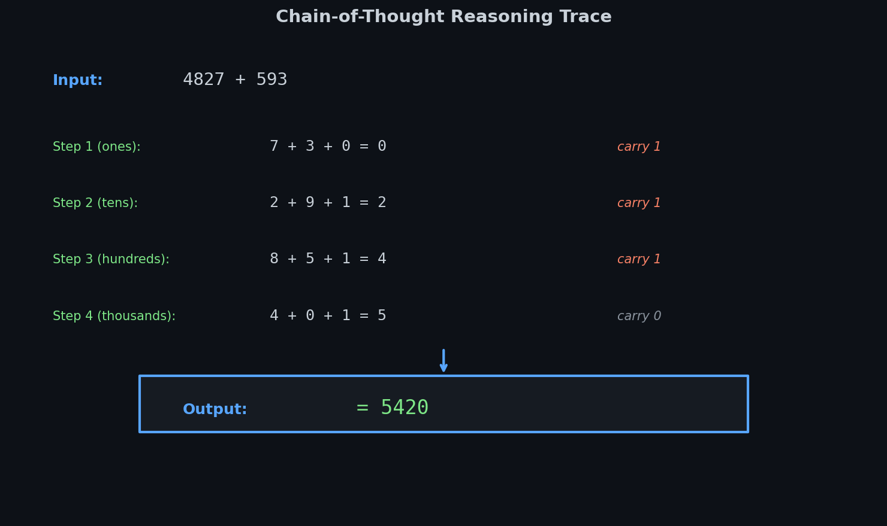
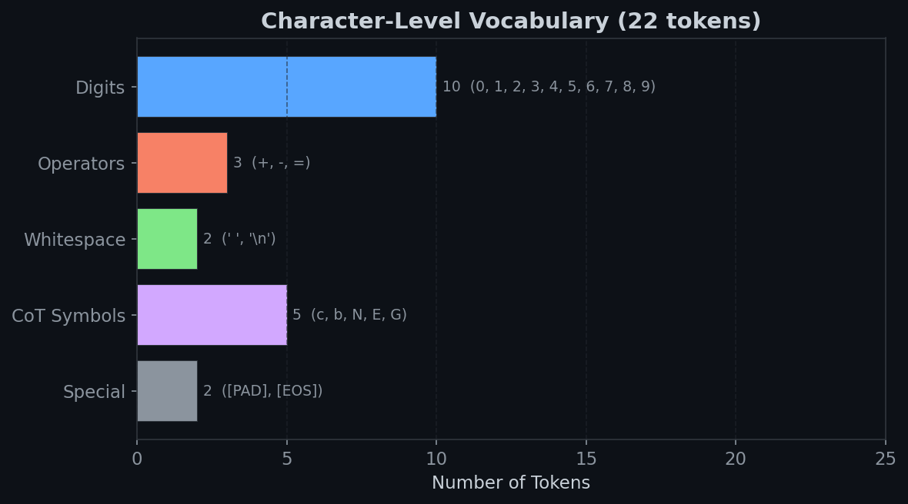
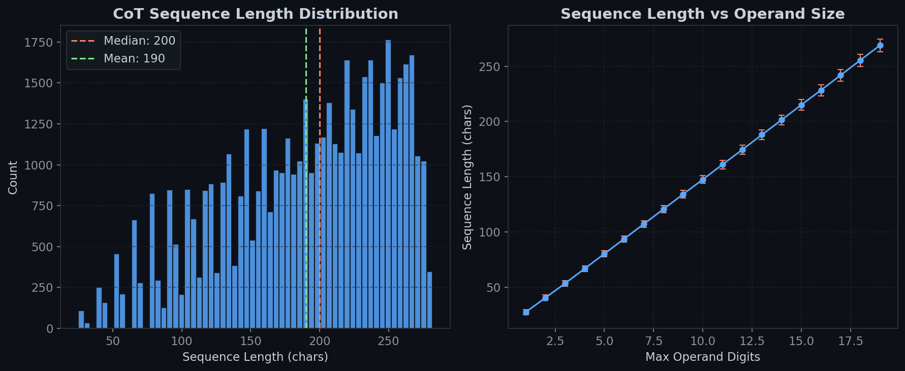

# pureAddition

**A 15M-parameter decoder-only transformer that learns multi-digit arithmetic through chain-of-thought reasoning -- trained from scratch on purely synthetic data.**

LLMs are notoriously bad at addition. They're tokenized classifiers: carrying requires tracking discrete bit-states across columns, and standard subword tokenization fractures digits into meaningless chunks. A number like `9,347` might tokenize as `["93", "47"]` -- the model never sees individual digits, so it never learns columnar logic. This project asks: **what if we strip away all that baggage and teach a small language model arithmetic the way humans actually do it -- one digit at a time, right to left, with explicit carry tracking?**

The answer is chain-of-thought supervision. Instead of training a model to map `123 + 456` directly to `579`, we supervise on the full intermediate reasoning trace: each column addition, each carry bit, building toward the answer. The model doesn't just predict answers -- it learns the *algorithm*.

<p align="center"></p>

## Summary

- **Architecture:** 12-layer decoder-only transformer with **Rotary Position Embeddings** (RoPE), pre-norm residual blocks, and GELU activations. ~14.8M parameters.
- **Tokenization:** Character-level, 22-token fixed vocabulary. No BPE, no subword merging -- every digit is its own token. This is the whole point.
- **Training data:** Purely synthetic. Each epoch generates 100K fresh addition/subtraction problems with operands up to 19 digits ($10^{19}$). No dataset files, no memorization -- infinite procedural generation.
- **Chain-of-Thought:** Every training example includes a full digit-by-digit reasoning trace with carry/borrow tracking. The model is supervised on the *process*, not just the result.
- **Loss masking:** Prompt tokens are masked with `IGNORE_INDEX = -100` so the model only learns to predict the reasoning and answer, not to parrot the question back.
- **Scheduler:** Linear warmup (100 steps) into cosine decay over ~312K total steps.
- **Early stopping:** Patience-based on validation loss with configurable `min_delta`.

## Architecture

```
Input IDs ──> Token Embedding (22 x 320) ──> Dropout
                        │
           ┌────────────┴────────────┐
           │    x12 Transformer Blocks    │
           │  ┌──────────────────────┐   │
           │  │ LayerNorm            │   │
           │  │ Causal Self-Attention│   │
           │  │   (8 heads, RoPE)   │   │
           │  │ + Residual           │   │
           │  │ LayerNorm            │   │
           │  │ MLP (320 → 1280 → 320) │ │
           │  │   GELU + Dropout     │   │
           │  │ + Residual           │   │
           │  └──────────────────────┘   │
           └─────────────────────────────┘
                        │
              Final LayerNorm ──> LM Head (320 → 22)
                        │
                   Next-token logits
```

<p align="center"></p>

The MLP layers dominate at **820K parameters per block** (x12 = ~9.8M), followed by attention at **410K per block**. The embedding and head are trivially small because the vocabulary is only 22 tokens -- a deliberate design choice. Every parameter goes toward learning *reasoning structure*, not memorizing a massive token space.

## How to use

**Train from scratch:**
```bash
python main.py --config config.json --demo 5
```

- `--config` -- path to hyperparameter config (default: `./config.json`)
- `--demo` -- number of demo problems to generate after training (default: 5, set to 0 to skip)

**Run queries against a trained checkpoint:**
```bash
python test_queries.py
```
Loads the most recent `best.pt` from `src/checkpoints/` and runs 5 hardcoded test problems.

**Run tests:**
```bash
pytest tests/
```

**Configuration** (`config.json`):
```json
{
    "vocab_size": 22,
    "d_model": 320,
    "n_heads": 8,
    "n_layers": 12,
    "d_ff": 1280,
    "max_seq_len": 512,
    "dropout": 0.1,
    "lr": 1e-3,
    "weight_decay": 0.1,
    "warmup_steps": 100,
    "batch_size": 32,
    "grad_clip": 1.0,
    "patience": 5,
    "min_delta": 0.001,
    "max_digits": 19,
    "epoch_size": 100000,
    "max_epochs": 100,
    "eval_samples": 200
}
```

**Key modules:**
- **`src/model.py`** -- `AdditionLM`: the full transformer with RoPE, generation, and loss computation
- **`src/tokenization.py`** -- `CharTokenizer`: fixed 22-token character-level tokenizer
- **`src/dataloading.py`** -- `CoTFormatter`: generates digit-by-digit reasoning traces; `EpochDataset`: streams fresh synthetic data each epoch
- **`src/train.py`** -- Training loop with mixed-precision, gradient clipping, early stopping, and accuracy evaluation

## Chain-of-Thought format

The core insight is that addition and subtraction are *sequential algorithms*, not lookup tables. The CoT format makes the carry/borrow state explicit at every column:

**Addition** (`4827 + 593`):
```
4827 + 593
7+3+0=0 c1
2+9+1=2 c1
8+5+1=4 c1
4+0+1=5 c0
= 5420
```

**Subtraction with borrow** (`500 - 123`):
```
500 - 123
0-3-0=7 b1
0-2-1=7 b1
5-1-1=3 b0
= 377
```

**Negative results** (`1 - 200`):
```
1 - 200
NEG
0-1-0=9 b1
0-0-1=9 b1
2-0-1=1 b0
= -199
```

Each line follows the pattern `digit_a OP digit_b OP carry = result cCARRY` (or `bBORROW` for subtraction). The `NEG` token signals that the result will be negated. This gives the model a **scratchpad** -- it doesn't have to hold carry state in its hidden representations alone; it can attend back to previous steps.

## Why character-level tokenization matters

<p align="center"></p>

Standard LLM tokenizers (BPE, WordPiece) destroy digit boundaries. The number `12345` might become `["123", "45"]` or `["1", "2345"]` depending on corpus statistics -- the tokenization has nothing to do with place value. This means the model has to *reverse-engineer* which tokens correspond to which digit positions before it can even start doing arithmetic.

Character-level tokenization sidesteps this entirely. Every digit is one token. Place value is positional. The model can learn columnar arithmetic directly because the input representation *matches the structure of the algorithm*.

The vocabulary is deliberately minimal: 10 digits, 3 operators (`+`, `-`, `=`), 2 whitespace characters, 5 CoT symbols (`c`, `b`, `N`, `E`, `G`), and 2 special tokens (`[PAD]`, `[EOS]`). Twenty-two tokens total. There's nothing for the model to memorize -- it has to learn the *procedure*.

## Training dynamics

<p align="center"></p>

The learning rate schedule uses **linear warmup** (100 steps) to stabilize early training, then **cosine decay** over the remaining ~312K steps. This is critical -- arithmetic CoT has sharp loss landscapes early on because the model is trying to simultaneously learn digit tokenization, positional structure, carry logic, and output formatting.

**Key training details:**
- **Fresh data every epoch:** Each epoch procedurally generates 100K new problems from a seeded PRNG. The model never sees the same equation twice, which forces genuine algorithmic generalization rather than memorization.
- **Prompt masking:** Loss is only computed on the reasoning trace and answer tokens. The prompt (`4827 + 593\n`) is masked so the model isn't penalized for "predicting" the input.
- **Mixed-precision training:** Uses `torch.amp.autocast` and `GradScaler` for faster training on CUDA.
- **Accuracy evaluation:** After each epoch, the model generates solutions to 200 fresh problems and checks whether the extracted answer matches the expected result.

## The hard part: carry propagation at scale

<p align="center"></p>

This is what makes arithmetic fundamentally difficult for neural networks. The **carry chain** can propagate across every digit position -- `999...9 + 1` produces a carry at every column. For 19-digit operands, that's up to 19 sequential dependencies that the model must track correctly.

On average, about half of the digit columns produce a carry (converging toward $d/2$ as operand size grows). But the worst case is $d$ consecutive carries, which requires the model to maintain a perfect sequential chain of reasoning. **A single incorrect carry prediction corrupts every subsequent digit.** This is why CoT supervision is essential -- without it, the model would need to represent these long-range dependencies entirely in its hidden state.

## Sequence length scaling

<p align="center"></p>

CoT traces scale linearly with operand size: each digit column produces one line of reasoning, plus the prompt and answer. For max 19-digit operands, sequences can reach ~280 characters. The `max_seq_len` of 512 provides comfortable headroom.

The distribution peaks around 190-200 characters because operand digit counts are sampled uniformly from `[1, 19]` -- most problems involve operands of moderate size. The right panel shows the near-perfect linear relationship between max operand digits and sequence length, which is a nice property: the model's computational budget scales proportionally with problem difficulty.

## Process

1. **This project started from a question I kept coming back to after my earlier work on how neural networks represent arithmetic internally** (see my [mechanistic interpretability experiments](https://www.linkedin.com/feed/update/urn:li:activity:7316488488768593920/)). I had already shown that a small MLP trained on addition just builds an expensive modular lookup table, and that a 15M-parameter SLM discovers helical structure in Fourier space when trained on wide-range addition. The natural next question was: can we make a model that actually *computes* rather than *approximates*?

2. **The first iterations of this project went through several pivots.** Early commits show me trying downloaded math datasets, WordPiece tokenization, weight tying, and two-stage training. None of it worked well. The fundamental issue was always the same: subword tokenization fragments digit structure, and real-world math datasets are noisy and inconsistent.

3. **The breakthrough was going fully synthetic and character-level.** Once I committed to procedural data generation with explicit CoT traces and a fixed character vocabulary, everything simplified. No dataset downloading, no tokenization edge cases, no data cleaning. The model just trains on pure algorithmic reasoning traces.

4. **Subtraction with negation was trickier than expected.** When $a < b$, you can't just reverse-subtract column by column -- you need to negate the result of $b - a$. The `NEG` token in the CoT trace handles this, but getting the borrow logic right in `_sub_digit_steps` took more careful debugging than the addition path.

5. **Scaling to 19-digit operands required bumping from the initial architecture.** The git history shows a progression from smaller configs to the current 12-layer, 320-dim model. Larger operands mean longer CoT traces, more carry propagation, and harder long-range dependencies. The model needs enough depth to attend over the full reasoning chain.

## Final notes

**What this project is really about:** This isn't a useful calculator. It's a demonstration that **explicit algorithmic supervision** (chain-of-thought) can teach a small transformer to generalize arithmetic in a way that direct input-output mapping cannot. The model learns to *execute a procedure*, not to approximate a function.

**What I'd do differently:**
- **Curriculum learning** -- start with small operands and gradually increase digit count. Right now the model sees 19-digit problems from epoch 1, which is probably wasteful early in training.
- **Operand-length-stratified evaluation** -- the current accuracy metric averages over all digit counts. A breakdown by operand size would reveal exactly where the model starts struggling.
- **Attention visualization** -- for mechanistic interpretability, it would be valuable to visualize which previous CoT steps the model attends to when predicting carry bits. My hypothesis is that attention to the previous carry token should be extremely strong.

**Connection to mechanistic interpretability:** This project is a stepping stone. The helical manifold work showed *what* representations a network learns for arithmetic. This project asks *how* we can shape those representations through structured supervision. The next step is cracking open this model's internals and seeing whether the CoT training produces cleaner, more interpretable internal representations than end-to-end training.

## Requirements

```
torch
tokenizers
```

Python 3.10+. CUDA optional but recommended.
