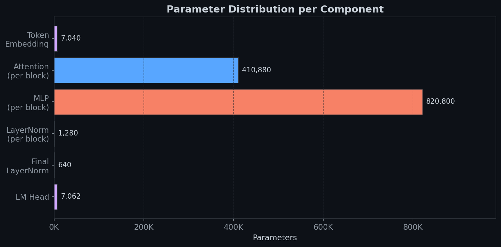
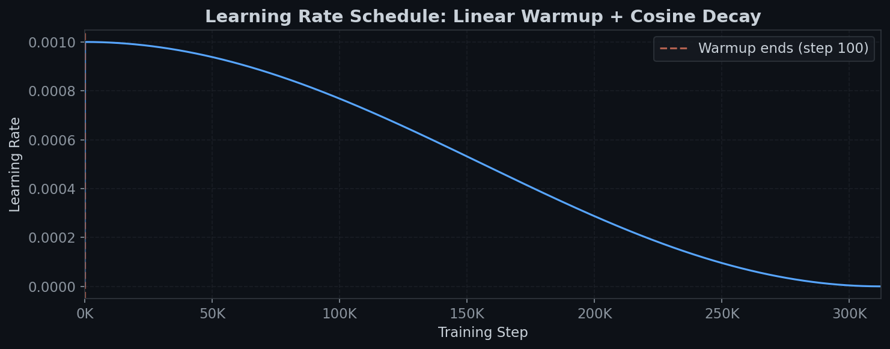
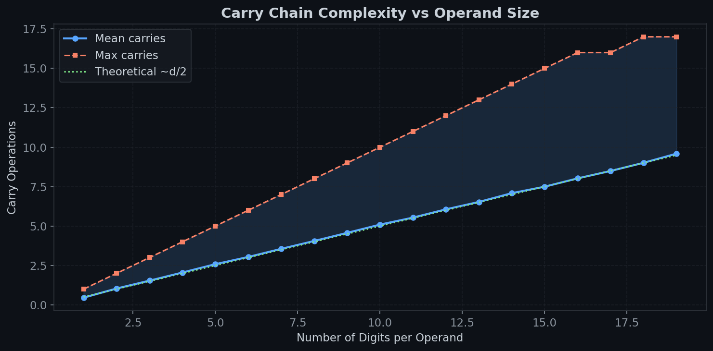

# pureAddition

**A 15M-parameter decoder-only transformer that learns multi-digit arithmetic through chain-of-thought reasoning -- trained from scratch on purely synthetic data.**

LLMs fail at arithmetic because subword tokenization fractures digits into meaningless chunks, destroying place-value structure. This model uses character-level tokenization and explicit chain-of-thought supervision to teach a small transformer to *execute* columnar addition/subtraction rather than approximate it.

## Skills & Frameworks

`Python` `PyTorch` `Transformer Architecture` `Rotary Position Embeddings (RoPE)` `Chain-of-Thought Supervision` `Character-Level Tokenization` `Synthetic Data Generation` `Mixed-Precision Training (AMP)` `Cosine LR Scheduling` `Gradient Clipping` `Early Stopping` `Mechanistic Interpretability`

## Architecture

- **12-layer decoder-only transformer** with RoPE, pre-norm residual blocks, GELU activations. ~14.8M parameters.
- **Character-level tokenizer:** 22-token fixed vocabulary. Every digit is its own token -- no BPE, no subword merging.
- **Synthetic data:** Each epoch generates 100K fresh problems (operands up to 19 digits / $10^{19}$). No dataset files, no memorization.
- **Loss masking:** Prompt tokens masked (`IGNORE_INDEX = -100`) so the model only learns to predict reasoning and answers.
- **Scheduler:** Linear warmup (100 steps) into cosine decay over ~312K steps.

```
Input IDs ──> Token Embedding (22 x 320) ──> Dropout
                        │
           ┌────────────┴────────────┐
           │    x12 Transformer Blocks    │
           │  ┌──────────────────────┐   │
           │  │ LayerNorm            │   │
           │  │ Causal Self-Attention│   │
           │  │   (8 heads, RoPE)   │   │
           │  │ + Residual           │   │
           │  │ LayerNorm            │   │
           │  │ MLP (320 → 1280 → 320) │ │
           │  │   GELU + Dropout     │   │
           │  │ + Residual           │   │
           │  └──────────────────────┘   │
           └─────────────────────────────┘
                        │
              Final LayerNorm ──> LM Head (320 → 22)
                        │
                   Next-token logits
```

<p align="center"></p>

MLP layers dominate at **820K params per block** (x12 = ~9.8M), followed by attention at **410K per block**. The 22-token vocabulary keeps embedding/head trivially small -- every parameter goes toward learning reasoning structure.

## Chain-of-Thought Format

The CoT format makes carry/borrow state explicit at every column, giving the model a scratchpad it can attend back to:

**Addition** (`4827 + 593`):
```
4827 + 593
7+3+0=0 c1
2+9+1=2 c1
8+5+1=4 c1
4+0+1=5 c0
= 5420
```

**Subtraction with borrow** (`500 - 123`):
```
500 - 123
0-3-0=7 b1
0-2-1=7 b1
5-1-1=3 b0
= 377
```

**Negative results** (`1 - 200`):
```
1 - 200
NEG
0-1-0=9 b1
0-0-1=9 b1
2-0-1=1 b0
= -199
```

Each line: `digit_a OP digit_b OP carry = result cCARRY|bBORROW`. The `NEG` token signals result negation.

## Training Dynamics

<p align="center"></p>

- **Fresh data every epoch:** 100K procedurally generated problems from a seeded PRNG. The model never sees the same equation twice, forcing algorithmic generalization over memorization.
- **Prompt masking:** Loss computed only on reasoning trace and answer tokens.
- **Mixed-precision:** `torch.amp.autocast` + `GradScaler` for CUDA acceleration.
- **Accuracy eval:** Each epoch, the model generates solutions to 200 fresh problems and checks extracted answers against ground truth.

## Carry Propagation at Scale

<p align="center"></p>

The carry chain can propagate across every digit position -- `999...9 + 1` produces a carry at every column. For 19-digit operands, that's up to 19 sequential dependencies. **A single incorrect carry corrupts every subsequent digit.** This is why CoT supervision is essential: without it, the model must represent these long-range dependencies entirely in hidden state.

## Process & Key Pivots

1. **Motivation:** Built on my earlier [mechanistic interpretability work](https://www.linkedin.com/feed/update/urn:li:activity:7316488488768593920/) showing that MLPs trained on addition build modular lookup tables and SLMs discover helical Fourier structure. This project asks: can we make a model *compute* rather than *approximate*?
2. **Failed approaches:** Downloaded math datasets, WordPiece tokenization, weight tying, two-stage training. Subword tokenization always fractured digit structure.
3. **Breakthrough:** Fully synthetic, character-level data with explicit CoT traces. No dataset downloads, no tokenization edge cases, no data cleaning.
4. **Subtraction complexity:** Negative results require computing $b - a$ then negating. The `NEG` token and borrow logic in `_sub_digit_steps` required careful debugging beyond the addition path.

## What I'd Do Next

- **Curriculum learning** -- start with small operands, gradually increase digit count instead of exposing 19-digit problems from epoch 1.
- **Attention visualization** -- verify whether carry-token attention patterns match the expected sequential dependency structure (mechanistic interpretability follow-up).

## How to Use

```bash
python main.py --config config.json --demo 5    # Train from scratch
python test_queries.py                           # Run queries against best.pt
pytest tests/                                    # Run tests
```

**Key modules:** `src/model.py` (transformer + RoPE + generation), `src/tokenization.py` (22-token char tokenizer), `src/dataloading.py` (CoT trace generation + synthetic data streaming), `src/train.py` (mixed-precision training loop).

## Requirements

```
torch
tokenizers
```

Python 3.10+. CUDA optional but recommended.
